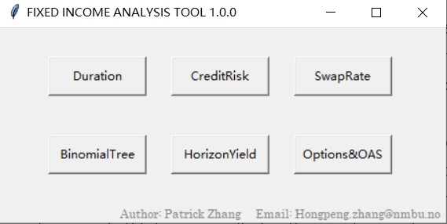
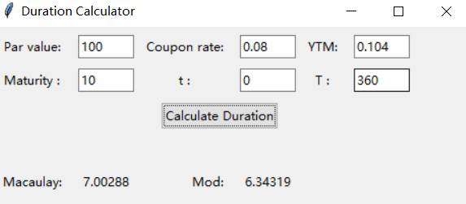
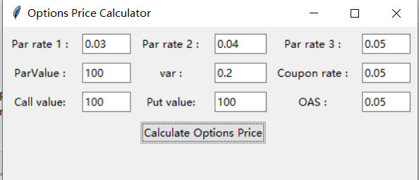
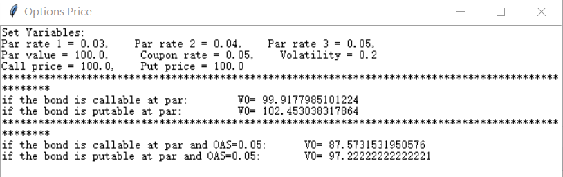

# FIXED INCOME ANALYSIS TOOL
A very user-friendly calculator application created using Python, easy to calculate some key indicators for bonds, 
like Macaulay duration, Credit spread, Option prices, Horizon yield, and so on. 

## Thank You!
Please ⭐ this repo if you think this is helpful.

## Screenshots

## Requirements 
* Python 3.10 or higher.

## How to use
Run the FIA_TOOL.py file. All required packages were listed in the environment.yaml file.

## Contributing 💡
The reason why I developed this software is, that I found it fussy, tedious, and very easy to make mistakes when I calculated some key indicators using a calculator or Excel for fixed income securities, and there was not any app or software designed dedicated for fixed income analysis, so I just decided to develop one by myself. You are very welcome to check the app and source codes here on GitHub, especially for those who are trying to invest in some bonds or preparing for their CFA tests, this app may help. Looking forward to any feedback!

